# Day 14 – SOC Tier 1 Incident Report: Threat Intelligence & OSINT Investigation

---

## Incident Summary

- **Incident Type:** Phishing Campaign Investigation Multi-IOC Threat Intelligence Analysis
- **Severity:** High (All IOCs Confirmed Malicious Active Campaign Infrastructure)
- **Detection Method:** Multi-Platform OSINT Correlation + Email Header Forensics
- **Tools Used:** VirusTotal, AbuseIPDB, MXToolbox, Whois (Kali Terminal)
- **Status:** Investigation Complete Full IOC Report Delivered

---

## Executive Summary

A threat intelligence investigation was conducted against three IOCs flagged during a simulated SOC alert. The suspicious IP address `185.220.101.45` was identified as a Tor exit node with a 100% abuse confidence score and 6,607 reports on AbuseIPDB. The domain `secure-login-verify.com` was confirmed malicious on VirusTotal with 8/92 detections.

Email header analysis exposed a spoofed PayPal sender, the same Tor exit node as the sending IP, and a mismatched Reply-To address — confirming all three IOCs are linked to the same coordinated phishing campaign. Full attribution, infrastructure mapping, and remediation guidance are documented below.

---

## Affected System

- **Investigation Scope:** Multi-IOC Phishing Campaign Triage
- **IOC Count:** 3 (1 IP, 1 Domain, 1 Email Sample)
- **Data Sources:**
  - VirusTotal (multi-engine reputation lookup)
  - AbuseIPDB (community abuse reporting)
  - MXToolbox (email header and blacklist analysis)
  - Whois (infrastructure ownership and registration data)

---

## Investigation Methodology

---

### 1. Threat Intelligence Platform Launch

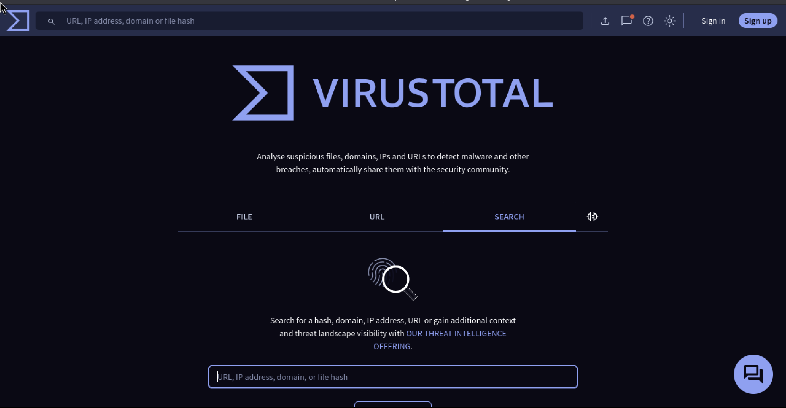

- Initialized VirusTotal as the primary multi engine reputation platform
- Confirmed platform accessibility and query readiness
- Established the OSINT entry point for the IOC triage workflow

### SOC Observations:

- VirusTotal aggregates 90+ engines, making it the standard first stop in IOC triage
- Multi-platform corroboration must always follow initial lookups
- OSINT investigations begin with reputation, then expand to infrastructure

---

### 2. IOC 1 Suspicious IP: VirusTotal Initial Lookup

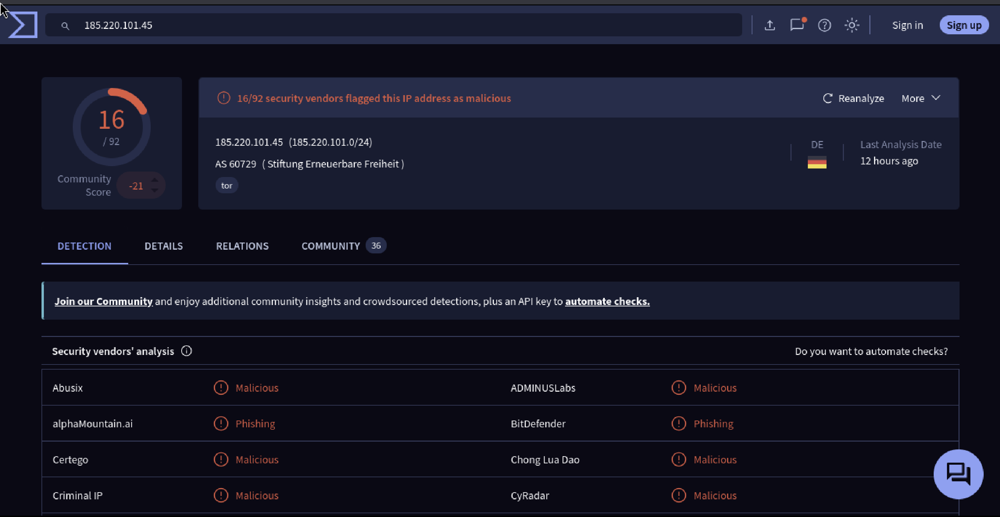

- Submitted IP `185.220.101.45` to VirusTotal
- Detection ratio: **16/92 engines flagged the IP as malicious**
- Classification: Phishing infrastructure

### SOC Observations:

- IP reputation hits above 10/90 warrant immediate escalation
- Multi engine consensus is a high confidence malicious indicator
- Classification (phishing) directly informs investigation hypothesis

---

### 3. IOC 1 Suspicious IP: VirusTotal Detailed Analysis

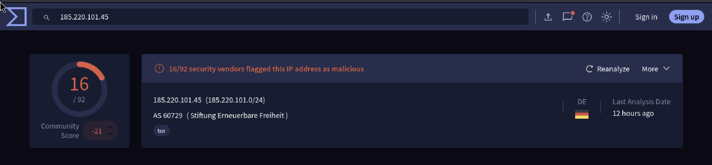

- Reviewed VirusTotal community comments, associated samples, and passive DNS history
- Identified linked malicious files and domains
- Captured first seen and last seen timestamps

### SOC Observations:

- Passive DNS history surfaces additional IOCs for pivot analysis
- Associated malware samples confirm infrastructure reuse
- Timestamps inform whether the threat is active or historical

---

### 4. IOC 1 AbuseIPDB Cross-Validation (Part 1)

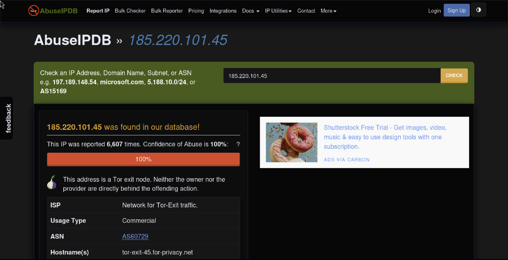

- Cross-validated the IP on AbuseIPDB
- **Confidence of Abuse: 100%**
- **Total Reports: 6,607 from 607 distinct sources**

### SOC Observations:

- 100% abuse confidence with thousands of reports is unambiguous attribution
- Distinct reporting sources rule out single reporter false positives
- This is enterprise grade IOC validation directly actionable

---

### 5. IOC 1 AbuseIPDB Cross-Validation (Part 2)

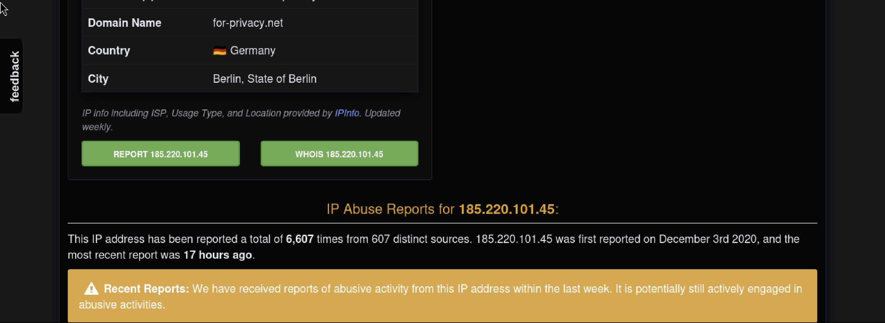

- Reviewed detailed abuse history and categorical breakdown
- Captured most recent report timeline IP actively abusive
- Documented multi category abuse: phishing, brute-force, fraud

### SOC Observations:

- Recent reports confirm ongoing malicious activity (not stale data)
- Multi-category abuse indicates infrastructure used across attack types
- Continuous abuse history supports permanent block recommendation

---

### 6. IOC 2 — Suspicious Domain: VirusTotal Lookup

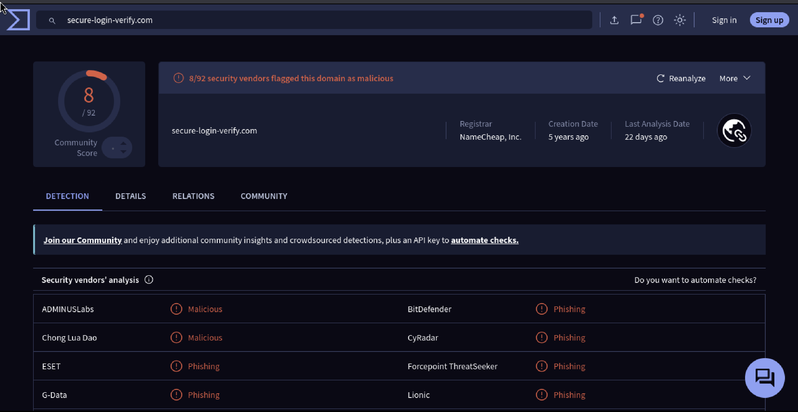

- Submitted domain `secure-login-verify.com` to VirusTotal
- Detection ratio: **8/92 engines flagged the domain as malicious**
- Confirmed phishing-themed naming pattern (`secure`, `login`, `verify`)

### SOC Observations:

- Detection ratio on domains tends to lag IP reputation 8/92 is significant
- Phishing themed lexical patterns are universal red flags
- Naming patterns alone justify domain blocking at the DNS layer

---

### 7. IOC 2 Domain: VirusTotal Detailed Analysis

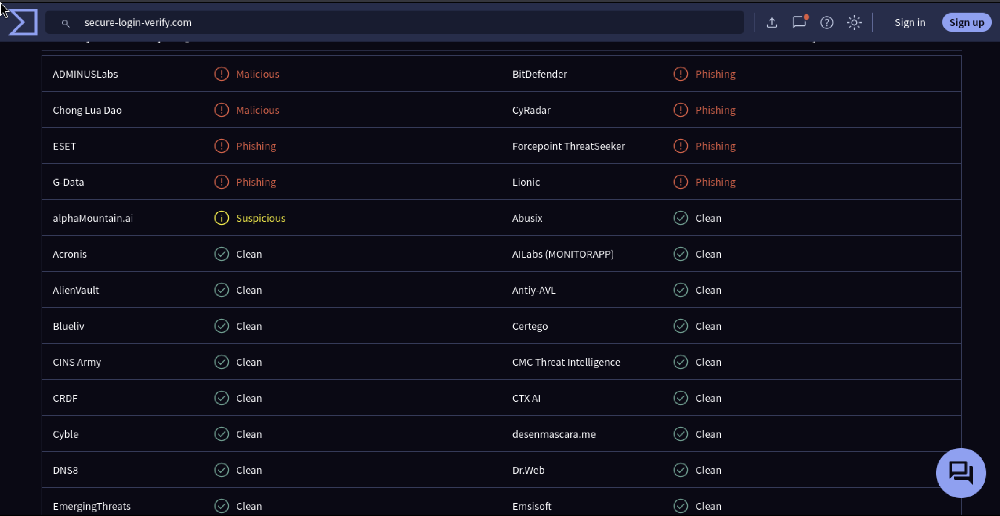

- Reviewed associated subdomains, resolutions, and detection history
- Captured passive DNS data linking the domain to the suspect IP
- Documented engine-specific classifications (phishing, malware, suspicious)

### SOC Observations:

- Passive DNS confirms domain IP infrastructure relationship
- Engine consensus on phishing classification reinforces attribution
- Subdomain enumeration may surface additional campaign infrastructure

---

### 8. IOC 2 Domain: Whois Lookup

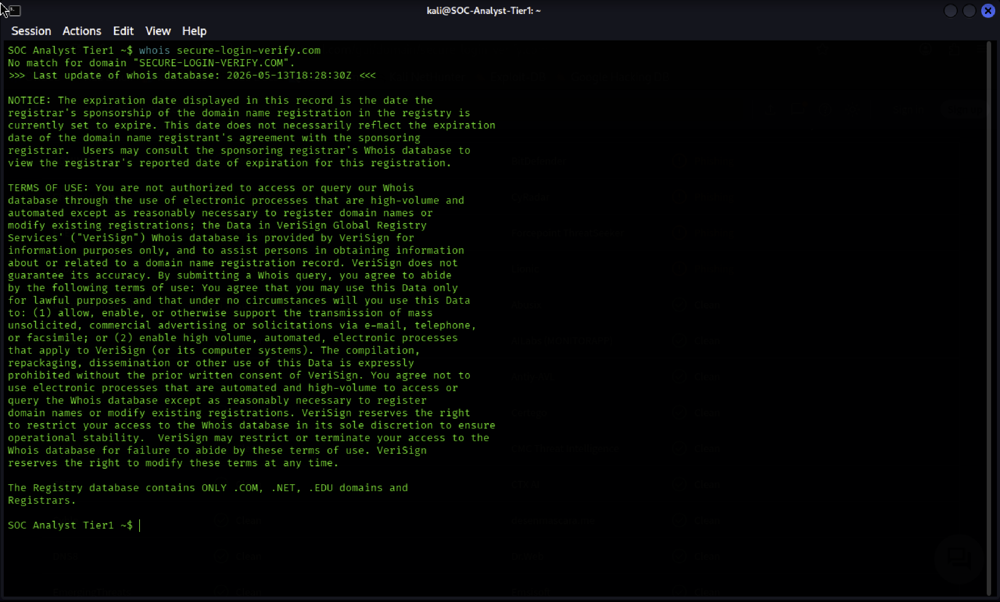

- Performed `whois` lookup on `secure-login-verify.com`
- Result: **No match domain taken down**
- Assessed pattern: short lived phishing domain abandoned post-campaign

### SOC Observations:

- Domain takedown post-investigation is consistent with phishing TTPs
- Short-lived registration is a hallmark of disposable attacker infrastructure
- Domain absence does not invalidate findings historical attribution remains

---

### 9. IOC 1 IP Whois: Infrastructure Analysis (Part 1)

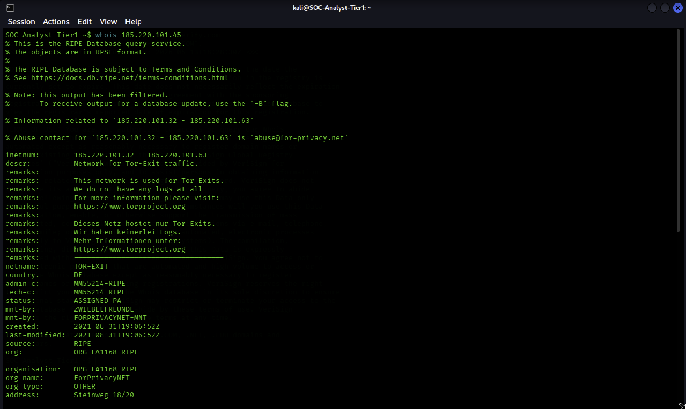

- Performed `whois` lookup on `185.220.101.45`
- Identified organization: **ForPrivacyNET**
- Confirmed netrange: **`185.220.101.32 - 185.220.101.63`**

### SOC Observations:

- Hosting organization identification supports infrastructure attribution
- Netrange data enables block list expansion beyond a single IP
- Privacy-focused hosting (ForPrivacyNET) is consistent with Tor infrastructure

---

### 10. IOC 1 IP Whois: Infrastructure Analysis (Part 2)

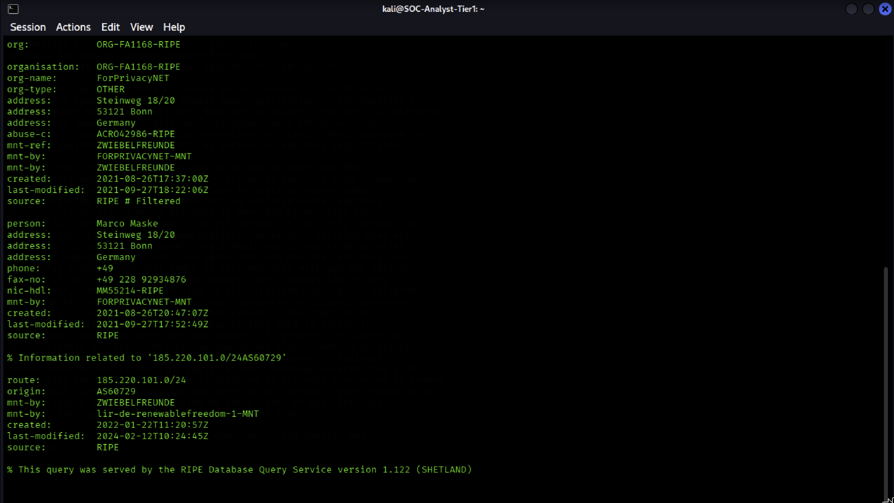

- Captured geolocation: **Germany, Berlin**
- Confirmed IP classification: **Tor exit node**
- Documented infrastructure context for the campaign

### SOC Observations:

- Tor exit nodes are universally high risk for inbound traffic
- Geolocation alone is not attribution Tor obscures true origin
- Block recommendation extends to the full Tor exit node range

---

### 11. IOC 3 Email: MXToolbox Header Analysis (Part 1)

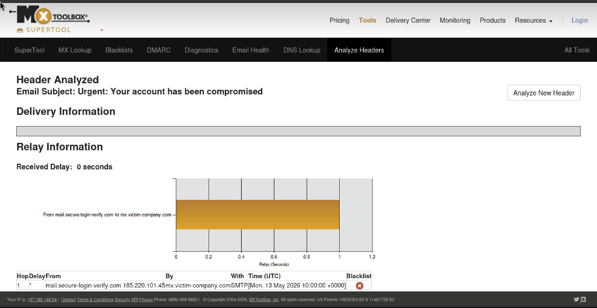

- Submitted phishing email headers to MXToolbox
- Identified spoofed sender: `security@paypal.com`
- Confirmed sending IP: `185.220.101.45` (matches IOC 1)

### SOC Observations:

- Email header forensics is the single highest-value phishing technique
- Sender–IP mismatch is the smoking gun for spoofing
- The shared IP across IOCs proves campaign-level correlation

---

### 12. IOC 3 Email: MXToolbox Header Analysis (Part 2)

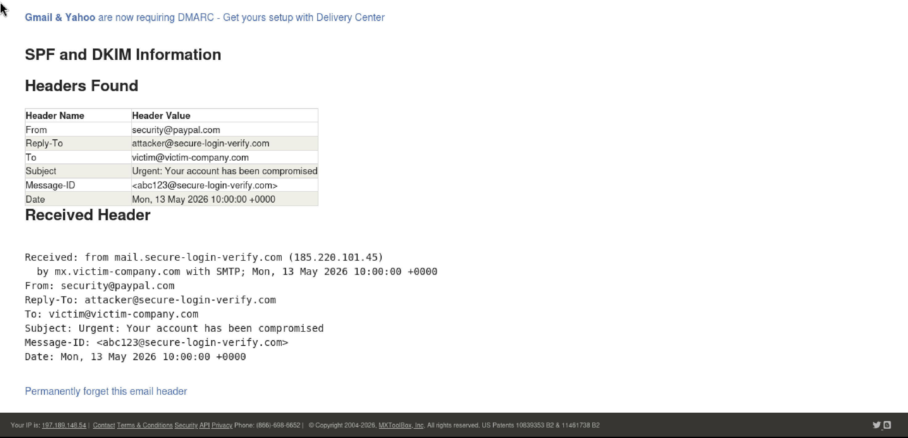

- Captured Reply-To address: `attacker@secure-login-verify.com` (matches IOC 2)
- Confirmed blacklist status: **On blacklist malicious**
- Confirmed SPF / DKIM: **Not present** no email authentication

### SOC Observations:

- Reply-To mismatch with From: address is a definitive spoofing indicator
- Absence of SPF/DKIM allows trivial email impersonation
- Blacklist hits across multiple feeds confirm broad recognition of the threat

---

## IOC Investigation Summary

### IOC 1 — Suspicious IP Address

| Field                    | Finding                                |
|--------------------------|----------------------------------------|
| **IP**                   | `185.220.101.45`                       |
| **VirusTotal Detection** | 16/92 — Malicious                      |
| **Category**             | Phishing                               |
| **AbuseIPDB Score**      | 100%                                   |
| **Total Reports**        | 6,607 from 607 distinct sources        |
| **Type**                 | Tor Exit Node                          |
| **Organisation**         | ForPrivacyNET                          |
| **NetRange**             | `185.220.101.32 - 185.220.101.63`      |
| **Country**              | Germany, Berlin                        |
| **Last Reported**        | Actively abusive                       |
| **Recommended Action**   | Block entire netrange at firewall      |

---

### IOC 2 — Suspicious Domain

| Field                    | Finding                                          |
|--------------------------|--------------------------------------------------|
| **Domain**               | `secure-login-verify.com`                        |
| **VirusTotal Detection** | 8/92 — Malicious                                 |
| **Whois Result**         | No match — domain taken down                     |
| **Assessment**           | Short-lived phishing domain — abandoned post-campaign |
| **Recommended Action**   | Block at DNS and email gateway                   |

---

### IOC 3 — Phishing Email Header Analysis

| Field                | Finding                                  | Risk                       |
|----------------------|------------------------------------------|----------------------------|
| **From**             | `security@paypal.com`                    | ❌ Spoofed sender          |
| **Reply-To**         | `attacker@secure-login-verify.com`       | ❌ Real attacker address   |
| **Sending IP**       | `185.220.101.45`                         | ❌ Known Tor exit node     |
| **Sending Domain**   | `mail.secure-login-verify.com`           | ❌ Malicious domain        |
| **Blacklist Status** | On blacklist                             | ❌ Confirmed malicious     |
| **SPF / DKIM**       | Not present                              | ❌ No email authentication |
| **Recommended Action** | Block sender domain + user education   | —                          |

---

## IOC Correlation

All three IOCs are linked to the same coordinated phishing campaign:

```
Phishing Email
   ├── Sent from: 185.220.101.45 (Tor Exit Node)
   ├── Using domain: secure-login-verify.com
   └── Spoofing: security@paypal.com
```

---

## Indicators of Compromise (IOCs)

| Type             | Indicator                                | Source                |
|------------------|------------------------------------------|-----------------------|
| Malicious IP     | `185.220.101.45`                         | VirusTotal, AbuseIPDB |
| IP Netrange      | `185.220.101.32 - 185.220.101.63`        | Whois                 |
| Malicious Domain | `secure-login-verify.com`                | VirusTotal            |
| Subdomain        | `mail.secure-login-verify.com`           | Email Headers         |
| Spoofed Sender   | `security@paypal.com`                    | Email Headers         |
| Attacker Reply   | `attacker@secure-login-verify.com`       | Email Headers         |
| Infrastructure   | ForPrivacyNET (Tor exit hosting)         | Whois                 |
| Authentication   | Missing SPF / DKIM                       | MXToolbox             |

---

## MITRE ATT&CK Mapping

| Behavior                                | Technique ID | Description                                              |
|-----------------------------------------|--------------|----------------------------------------------------------|
| Phishing                                | T1566        | Spoofed PayPal email sent to victim                      |
| Phishing: Spearphishing Link            | T1566.002    | Email designed to drive credential harvesting            |
| Acquire Infrastructure: Domains         | T1583.001    | Disposable phishing domain registered for campaign       |
| Proxy: Multi-hop Proxy                  | T1090.003    | Tor exit node used to anonymize attacker origin          |
| Masquerading: Match Legitimate Name     | T1036.005    | PayPal brand spoofed in sender address                   |
| Establish Accounts: Email Accounts      | T1585.002    | Attacker controlled Reply-To address used                |

---

## SOC Analyst Findings

- Three IOCs confirmed malicious and linked to a single phishing campaign
- Suspect IP is an actively abused Tor exit node with 100% AbuseIPDB confidence
- Malicious domain confirmed by VirusTotal and Whois data (post campaign takedown)
- Email header forensics expose spoofed sender, mismatched Reply-To, and missing SPF/DKIM
- Cross-IOC correlation establishes campaign level attribution
- Infrastructure analysis identifies netrange and hosting organization for block-list expansion
- No SPF / DKIM enforcement on the spoofed brand domain allowed trivial impersonation

---

## SOC Analyst Response

- Block the full Tor exit netrange `185.220.101.32 - 185.220.101.63` at the perimeter firewall
- Block `secure-login-verify.com` and `mail.secure-login-verify.com` at the DNS and email gateway layers
- Add all three IOCs to the SIEM watchlist for retroactive and real time correlation
- Quarantine the original phishing email and search for additional internal recipients
- Reset credentials for any users who interacted with the email
- Submit campaign IOCs to internal threat intelligence sharing platforms
- Recommend SPF, DKIM, and DMARC enforcement to prevent future brand impersonation
- Deliver targeted user-awareness training using this email as a case study

---

## Analyst Insight

The strongest threat intelligence work is correlation work. Each of these three IOCs in isolation would warrant investigation but together they form attribution: same IP, same domain infrastructure, same spoofed brand, same campaign. The use of a Tor exit node and a disposable domain reflects the playbook of modern phishing operators: low-cost, high-volume, and intentionally short-lived. SOC analysts who pivot between platforms (reputation → infrastructure → header forensics) consistently convert isolated alerts into actionable campaign level intelligence.

---

## Learning Outcome

This investigation demonstrates the ability to:

- Conduct multi-source threat intelligence investigations on IPs, domains, and emails
- Cross-validate IOCs across VirusTotal, AbuseIPDB, MXToolbox, and Whois
- Analyze email headers to detect spoofing, missing authentication, and attacker infrastructure
- Pivot between IOCs to establish campaign-level attribution
- Identify and document Tor-based attacker anonymization infrastructure
- Apply MITRE ATT&CK mapping to phishing campaign analysis
- Produce actionable remediation plans aligned with IOC findings
- Recognize the role of SPF, DKIM, and DMARC in preventing brand impersonation

---

## Repository Structure

```
threat-intelligence-osint-lab/
├── README.md
└── screenshots/
    ├── 01_virustotal_homepage.png
    ├── 02_virustotal_ip_results.png
    ├── 03_virustotal_ip_details.png
    ├── 04_abuseipdb_results_1.png
    ├── 04_abuseipdb_results_2.png
    ├── 05_virustotal_domain_results.png
    ├── 06_virustotal_domain_details.png
    ├── 07_whois_domain_lookup.png
    ├── 08_whois_ip_lookup_1.png
    ├── 08_whois_ip_lookup_2.png
    ├── 10_mxtoolbox_analysis_1.png
    └── 10_mxtoolbox_analysis_2.png
```

---

## Conclusion

This investigation demonstrates a real-world threat intelligence and OSINT workflow. Three IOCs were validated across four industry standard platforms VirusTotal, AbuseIPDB, MXToolbox, and Whois and correlated into a single coordinated phishing campaign leveraging Tor anonymization and brand impersonation. The output mirrors the exact process a SOC Tier 1 or CTI analyst follows when triaging suspicious indicators: reputation lookup, cross validation, infrastructure analysis, header forensics, correlation, and actionable remediation.
